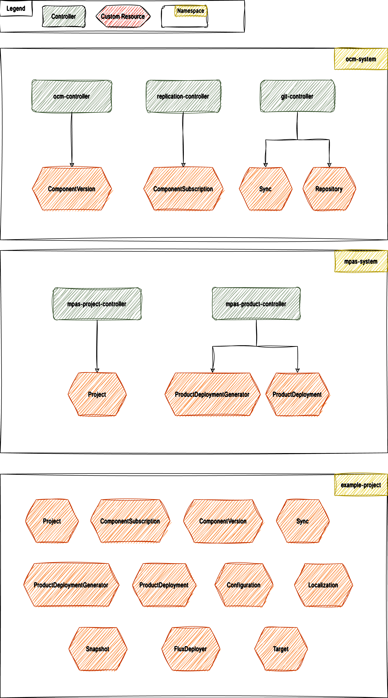
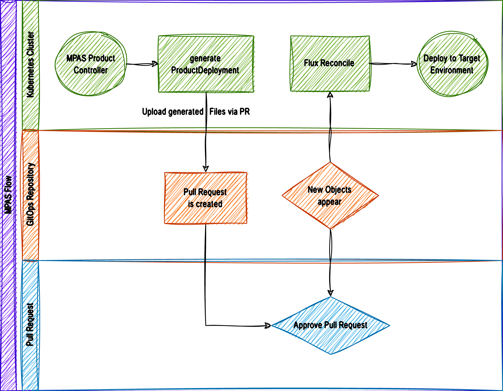

[](https://api.reuse.software/info/github.com/open-component-model/demo-secure-delivery)

# MPAS with Flux and Open Component Model

## High-level demo overview

This demo deploys MPAS (Multi Product Pipeline Automation System), a system that is built on OCM and Flux. It demonstrates how OCM and Flux can be employed to deploy software products into air-gapped environments.

The demo environment consists of [Gitea](https://about.gitea.com), [Tekton](https://tekton.dev), [Flux](https://fluxcd.io) and the [MPAS](https://github.com/open-component-model/MPAS) and [OCM controllers](https://github.com/open-component-model/ocm-controller). It uses [kind](https://kind.sigs.k8s.io) to host all parts in a local K8s cluster and creates two isolated areas for the software producer and the consumer to simulate a real air-gapped setup.


## MPAS

MPAS uses the following three namespaces and creates and controls resources in those namespaces.



The `example-project` on the last diagram is the target namespace for applied resources. This is configurable by the user who
creates the `project` resource. In the demo it is named `mpas-ocm-application`.

There are five main controllers in MPAS:

### [ocm-controller](https://github.com/open-component-model/ocm-controller)

Responsible for fetching product components and resources for those components. It also reconciles the following resources:

- `ComponentVersion`
- `Localization`
- `Configuration`

### [git-controller](https://github.com/open-component-model/git-controller)

Responsible for creating the GitOps repositories. It can handle various providers such as:

- github
- gitlab
- gitea

It uses the custom `Sync` resource to push content into those repositories.

### [replication-controller](https://github.com/open-component-model/replication-controller)

Responsible to keep a component version in the cluster up-to-date with a version defined by the consumer in the custom `ComponentSubscription` resource. It is possible to use a `semver` constraint, e.g. >=1.0.0 to take care that new released versions are automatically synchronized and updated in the cluster.


### [mpas-project-controller](https://github.com/open-component-model/mpas-project-controller)

Responsible for bootstrapping a whole project. Creating relevant access credentials, service accounts, roles and the
main GitOps repository.

Reconciles the `Project` object.

### [mpas-product-controller](https://github.com/open-component-model/mpas-product-controller)

Responsible for creating the product. We will explain this entity in more detail when walking through the demo.


## Demo Setup

As mentioned we use Gitea to host the repositories for both parties. Two organizations will be created:
- [software-provider](https://gitea.ocm.dev/software-provider)
- [software-consumer](https://gitea.ocm.dev/software-consumer)

The `software-provider` organization contains a repository that models the `podinfo` [application](https://github.com/open-component-model/podinfo). When the provider creates a new release, a Tekton CI pipeline is triggered that builds the component and pushes it to the [software provider's OCI registry](https://gitea.ocm.dev/software-provider/-/packages).

The `software-consumer` organization models an air-gapped scenario where applications are deployed from an own, secure OCI registry rather than directly from an arbitrary, public upstream source. The consumer creates a project and product subscriptions there.

The software consumer organization contains a repository named [ocm-applications](https://gitea.ocm.dev/software-consumer/ocm-applications). During the setup of the demo PRs are created which contain the Kubernetes manifests required to deploy the product component published by the software provider.

Once the pull requests are merged and the controllers generated new resources, Flux will kick in, start reconciling and deploy the component.



## Deployed products

We are going to deploy two products: [podinfo](https://github.com/stefanprodan/podinfo) and [Weave-Gitops front-end](https://github.com/weaveworks/weave-gitops). The [weave-gitops dashboard](https://weave-gitops.ocm.dev) can be used to understand the state of the cluster.

## Demo walkthrough

The demo is based on step-by-step instructions that are provided to guide you through the process of deploying the demo environment and the products. The scenario simulates actions on both sides, software provider and software consumer:

1. provider: cut a new release v1.0.0 for product "podinfo" which triggers a CI pipeline in Tekton
2. provider: verify the release automation process in the Tekton UI
3. consumer: trigger product deployment for two products, "podinfo" from steps 1. and 2. and the "Weave GitOps dashboard"
4. consumer: merge PRs for product deployment
5. consumer: access the deployed "podinfo" application
6. consumer: apply modification to product configuration
7. consumer: access the modified podinfo application
8. provider: cut a release update v1.1.0 with new features
9. provider: verify the release automation process in the Tekton UI
10. consumer: apply updated product version and keep modified configuration
11. consumer: monitor the application update

### 0. Setup demo environment

To deploy the demo environment execute the following:

`make run`

This step will install kind and then Gitea, Tekton and MPAS on top of the K8s cluster. Once the environment has been created, log in to [Gitea](https://gitea.ocm.dev) using the following credentials:

```
username: ocm-admin
password: password
```

### 1. Cut a release for `podinfo`

Navigate to: https://gitea.ocm.dev/software-provider/podinfo-component/releases and click "New Release".

Enter "v1.0.0" for both the tag name and release name, and then click "Publish Release".


### 2. Verify the release

Once the release is published, navigate to the [Pipeline Runs section in Tekton](https://ci.ocm.dev/#/namespaces/tekton-pipelines/pipelineruns) and check the progress of the release pipeline.


### 3. Install the Component(s)

When the release pipeline has been completed, MPAS will create a new PR that is used for the component installation. We can install the component by navigating to https://gitea.ocm.dev/software-consumer/ocm-applications/pulls/1. The PR contains ProductDeploymentGenerators for the two products we mentioned above, podinfo and weave GitOps. Just merge the pull request.


_Note_: If you see an error that the PR needs rebasing, you can ignore that.

### 4. Merge the two newly created PRs

The two product deploment generators from above will create two sets of PRs containing manifests that will further produce application-specific configuration resources, like Configuration, Localization and FluxDeployer.
These objects will be generated via the `mpas-product-controller`.


After the two PRs are merged, give it a minute and the applications should be reconciled.

Once all resources have been applied and reconciled, the Weave-Gitops application can be accessed under https://weave-gitops.ocm.dev. You can log in with

```
username: admin
password: password
```

_Note_: The deployment can take a little while because Flux needs to reconcile the new repository content. Until then, it might error because it's looking for a values.yaml file in the GitRepository object.

Once the two applications are merged, you should see two "products" under [products](https://gitea.ocm.dev/software-consumer/mpas-ocm-applications/src/branch/main/products).


### 5. View the application

We can view the `podinfo` Helm release that's been deployed in the default namespace: https://weave-gitops.ocm.dev/helm_release/graph?clusterName=Default&name=podinfo&namespace=default

We can also view the running application at https://podinfo.ocm.dev


### 6. Change configuration values

The application can be configured using the parameters exposed in `values.yaml`. Now that podinfo is deployed we can tweak a few parameters, navigate to
https://gitea.ocm.dev/software-consumer/mpas-ocm-applications/_edit/main/products/podinfo/values.yaml


and adopt the current values to

```yaml
podinfo:
  message: This is my updated message
  replicas: 2
  serviceAccountName: default
```

Commit the changes to the main branch and wait for it all to be reconciled back into the deployed application. In case you don't see your changes reflected you may ran into a know issue with the demo setup where two Flux repos track the same gitea repository.

### 7. View the configured application

Once the controllers and objects finish updating, you should have two running pods and an updated message:

```
kubectl get pods
NAME                           READY   STATUS    RESTARTS   AGE
podinfo-7fb6788b66-b5gml       1/1     Running   0          23s
podinfo-7fb6788b66-xh7bq       1/1     Running   0          23s
weave-gitops-db47485b8-6k4zb   1/1     Running   0          10m
```

Navigate to https://podinfo.ocm.dev to view the new message.


### 8. Cut a new release

Let's jump back to the provider repository and cut another release. This release will contain a new feature that changes the image displayed by the podinfo application. Follow the same process as before to create a release, bumping the version to `v1.1.0`. Make sure to select the branch _`new-release`_ to apply the updated configuration data.

### 9. Verify the release

Once the release is published, navigate to https://ci.ocm.dev/#/namespaces/tekton-pipelines/pipelineruns and follow the progress of the release automation.

### 10. Merge the new PR

This update will trigger a new PR for the application reconciling a new version:


It contains a diff to the values file back to the version that the vendor ships as default, since we adopted that config for our environment. Most likely
you want to keep your changes, so revert that changes by modifying the file on the PR branch. If not, just merge the PR as is. Either way, it
should result in a reconciliation of the application.

### 11. Monitor the application update

Jump back to https://weave-gitops.ocm.dev to view the rollout of the new release.


### 12. View the updated application

Finally, navigate to https://podinfo.ocm.dev which now displays the OCM logo in place of the cuttlefish and the updated application version of 6.3.6.


### 13. Provider updates validation and default configuration

The last scenario we will consider is when the provider changes the default configuration and updates the validation.
In addition to this, the consumer has some values that are ignored.

Let's start by ignoring the `replicas` count in the [values.yaml](https://gitea.ocm.dev/software-consumer/mpas-ocm-applications/_edit/main/products/podinfo/values.yaml) file.

Add an ignore comment next to it like this:

```yaml
    replicas: 1 #+mpas-ignore
```

Hit commit.

Now, let's release a new version of podinfo which will contain an update to this value and some additional validation
rules.

Navigate to the [Provider Repository's Release Page](https://gitea.ocm.dev/software-provider/podinfo-component/releases/new) and create a new release like this:


Once done, we should see a new PR on the [Consumer Repository](https://gitea.ocm.dev/software-consumer/mpas-ocm-applications/pulls).

Open the PR we should see a failing validation like this:


To find out what the validation error is, we can inspect the corresponding `Validation` object in Git:


Fix the value by editing it directly. You can do this by either checking out the branch and editing it there, or you can
edit it on the UI by navigating to the branch that the PR is opened from and hit `Edit` on the file.
Like this: `https://gitea.ocm.dev/software-consumer/mpas-ocm-applications/_edit/branch-1695040282/products/podinfo/values.yaml`
Assuming the branch is `branch-1695040282`.

Once the change is committed, the validation should pass and we are good to merge the commit.


We can see that the previous commit was failed and there is a new commit that fixed that validation.

### Conclusion

By leveraging the capabilities of Gitea, Tekton, Flux, and the MPAS system controllers, this demo showcases the seamless deployment of components and dependencies in a secure manner. The use of secure OCI registries and automated release pipelines ensures the integrity and reliability of the deployment process.

Users can easily set up the demo environment, cut releases, monitor release automation, view the Weave GitOps dashboard and observe the deployment and update of applications. We have presented a practical illustration of how OCM and Flux can be employed to facilitate the deployment and management of applications in air-gapped environments, offering a robust and efficient solution for secure software delivery.

## Contributing

Code contributions, feature requests, bug reports, and help requests are very welcome. Please refer to the [Contributing Guide in the Community repository](https://github.com/open-component-model/community/blob/main/CONTRIBUTING.md) for more information on how to contribute to OCM.

OCM follows the [CNCF Code of Conduct](https://github.com/cncf/foundation/blob/main/code-of-conduct.md).

## Licensing

Copyright 2022-2023 SAP SE or an SAP affiliate company and Open Component Model contributors.
Please see our [LICENSE](LICENSE) for copyright and license information.
Detailed information including third-party components and their licensing/copyright information is available [via the REUSE tool](https://api.reuse.software/info/github.com/open-component-model/demo-secure-delivery).
